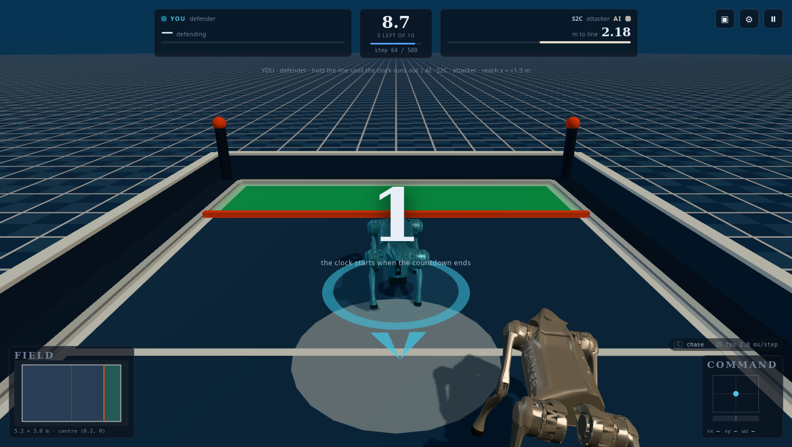

# S2C Web Play

Drive a Unitree Go2 against a trained policy, in your browser. Real MuJoCo physics compiled to
WebAssembly, the actual checkpoint weights from our experiments, and the same referee the simulator
uses — no scripted animation anywhere.

Companion demo for **Turning Safety into Competence: Minimally Exploitable Robot Policies via
Safety-Filtered Reinforcement Learning** ([project page](http://alliance-ai.cs.jhu.edu/s2c/)).



## The game

The **asymmetric touchdown game**, on a 5.2 × 3.0 m field. The attacker has 10 seconds to put its
trunk past the line at x = +1.9 m; the defender wins if the clock runs out. Either robot loses
immediately if it falls, leaves the field, or initiates a collision — the one closing faster on the
other is the one at fault.

You pick a side and an opponent:

| | |
|---|---|
| **You attack** | reach the green end zone before the clock runs out |
| **You defend** | keep the AI attacker out for ten seconds |
| **Opponents** | S2C (ours) · ET · Nominal · CPO · Lagrangian |

## Controls

| key | |
|---|---|
| `W` `S` | forward / back |
| `A` `D` | strafe left / right |
| `Q` `E` | turn left / right |
| `Shift` | sprint |
| `C` | camera (chase / first person / broadcast) |
| `Esc` | pause · `R` restart |
| mouse | orbit the camera, wheel to zoom |

Your keys become a velocity command `(vx, vy, ωz)` for a locomotion policy — the same interface the
real robot is driven with. You are not posing joints; you are giving a trained walker a target
velocity, and it figures out the legs.

## Running it locally

No build step, no npm install, no CDN. Any static server works:

```bash
python3 -m http.server 8000
# then open http://localhost:8000/
```

Tests (node 20+):

```bash
node tests/node_physics_smoke.mjs     # the WASM plant matches the training plant
node tests/node_policy_parity.mjs     # JS inference reproduces PyTorch to < 1e-5
node tests/node_referee.mjs           # both rule sets, terminal by terminal
node tests/node_match.mjs             # a whole match, headless, no browser
node tests/shoot_game.mjs             # the real page in headless Firefox + screenshots
```

## What is actually running

| piece | |
|---|---|
| physics | MuJoCo 3.14 (WASM, single thread) — 0.005 s steps, 4 per control step, 50 Hz control |
| robot | the Unitree Go2 model used in training: 23 collision primitives per robot, position actuators kp 20/20/40, kd 1/1/2 |
| your dog | a velocity-tracking locomotion policy trained in our fork of mjlab's Go2 walk task (`fastwalk_v3`, 9000 iterations, command box vx ∈ [−1.5, 3.0] m/s) |
| the AI | the game policies from the paper's roster, one checkpoint per method and seat |
| inference | hand-written MLP forward pass over `Float32Array` — no ONNX runtime, no framework |
| referee | the simulator's own terminals: `touchdown`, `trunk_contact`, `fell`, `oob`, `time_out` |
| rendering | three.js reading MuJoCo body poses; physics and visuals are separate — decoration never collides |

Policy weights live in `assets/policies/` as `.bin` + `.json` (layer shapes, activation, observation
normalizer, and the checkpoint each one came from). `assets/policies/manifest.json` is the registry;
nothing in the code hardcodes a checkpoint.

## Known differences from the training simulator

- Training runs on GPU MuJoCo (Warp/MJX); this runs the CPU C implementation compiled to WASM. Contact
  solving and floating-point details differ, so a match here will diverge from the same opening in the
  trainer. The policies are domain-randomised and transfer, but this is not a bit-exact replay.
- The opponent was trained against other policies, never against a human. You are out of distribution.
- The safety filter (the Q-CBF certificate that makes S2C what it is) is not wired into this build yet;
  the AI here is the task policy alone. The seam for it exists in `app/match.js`.
- The symmetric game (both robots racing) runs in the engine and is covered by the tests, but is not
  published in this build.

## Layout

```
index.html  styles.css      the page
app/        main.js         boot + the wall-clock loop
            physics.js      MuJoCo WASM harness
            policy.js       weight loading + MLP forward
            obs.js          the 47-D walk and 60-D game observations
            action.js       walk affine, and the increment integrator the game policies need
            match.js        the 50 Hz control loop
            referee.js      both rule sets
            config.js       every behaviour constant, each cited to the training code
            render.js       three.js scene and cameras
            ui.js hud.js input.js
assets/     scene/asym/     the exported MJCF, meshes and metadata
            policies/       exported weights + manifest
vendor/     mujoco/ three/  pinned, vendored, no CDN
tools/      export_scene.py export_policy.py
tests/      node + headless-browser harnesses
```
